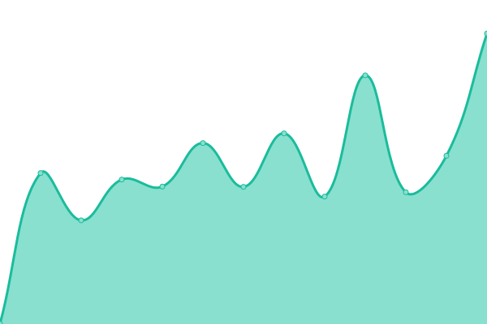
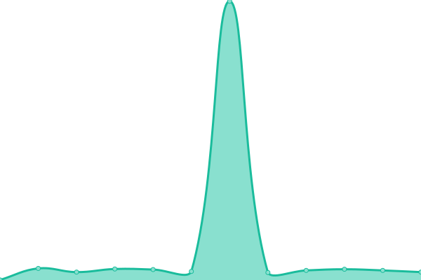

# [📈 Live Status](https://Liber-UFPE.github.io/upptime): <!--live status--> **🟧 Partial outage**

This repository contains the open-source uptime monitor and status page for [Laboratório Liber](http://www.liber.ufpe.br/), powered by [Upptime](https://github.com/upptime/upptime).

With [Upptime](https://upptime.js.org), you can get your own unlimited and free uptime monitor and status page, powered entirely by a GitHub repository. We use [Issues](https://github.com/Liber-UFPE/upptime/issues) as incident reports, [Actions](https://github.com/Liber-UFPE/upptime/actions) as uptime monitors, and [Pages](https://Liber-UFPE.github.io/upptime) for the status page.

<!--start: status pages-->
<!-- This summary is generated by Upptime (https://github.com/upptime/upptime) -->
<!-- Do not edit this manually, your changes will be overwritten -->
<!-- prettier-ignore -->
| URL | Status | History | Response Time | Uptime |
| --- | ------ | ------- | ------------- | ------ |
|  [Liber / Página Inicial](http://www.liber.ufpe.br/) | 🟩 Up | [liber-pagina-inicial.yml](https://github.com/Liber-UFPE/upptime/commits/HEAD/history/liber-pagina-inicial.yml) | 

 3661ms
     
 | 

<a href="https://Liber-UFPE.github.io/upptime/history/liber-pagina-inicial">98.85%</a>
    

|  [Liber / Monumenta Hyginia](http://www.liber.ufpe.br/hyginia/processSearch.jsp?query=recife) | 🟥 Down | [liber-monumenta-hyginia.yml](https://github.com/Liber-UFPE/upptime/commits/HEAD/history/liber-monumenta-hyginia.yml) | 

 173ms
     
 | 

<a href="https://Liber-UFPE.github.io/upptime/history/liber-monumenta-hyginia">37.32%</a>
    

|  [Liber / Visão Holandesa](http://www.liber.ufpe.br/visao_holandesa/Search.vh?query=recife) | 🟥 Down | [liber-visao-holandesa.yml](https://github.com/Liber-UFPE/upptime/commits/HEAD/history/liber-visao-holandesa.yml) | 

 20570ms
     
 | 

<a href="https://Liber-UFPE.github.io/upptime/history/liber-visao-holandesa">37.41%</a>
    

|  [Railway / Visão Holandesa](https://visaoholandesa.up.railway.app/health) | 🟩 Up | [railway-visao-holandesa.yml](https://github.com/Liber-UFPE/upptime/commits/HEAD/history/railway-visao-holandesa.yml) | 

 267ms
     
 | 

<a href="https://Liber-UFPE.github.io/upptime/history/railway-visao-holandesa">100.00%</a>
    

|  [Railway / Monumenta Hyginia](https://hyginia.up.railway.app/health) | 🟩 Up | [railway-monumenta-hyginia.yml](https://github.com/Liber-UFPE/upptime/commits/HEAD/history/railway-monumenta-hyginia.yml) | 

 253ms
     
 | 

<a href="https://Liber-UFPE.github.io/upptime/history/railway-monumenta-hyginia">100.00%</a>
    

|  [Railway / Pereira da Costa](https://pereira-da-costa.up.railway.app/health) | 🟩 Up | [railway-pereira-da-costa.yml](https://github.com/Liber-UFPE/upptime/commits/HEAD/history/railway-pereira-da-costa.yml) | 

 243ms
     
 | 

<a href="https://Liber-UFPE.github.io/upptime/history/railway-pereira-da-costa">100.00%</a>
    

|  [Liber / Memórias do Golpe](http://www.liber.ufpe.br/tg/modules/busca/listar_projeto.php?cod=1) | 🟩 Up | [liber-memorias-do-golpe.yml](https://github.com/Liber-UFPE/upptime/commits/HEAD/history/liber-memorias-do-golpe.yml) | 

 602ms
     
 | 

<a href="https://Liber-UFPE.github.io/upptime/history/liber-memorias-do-golpe">98.97%</a>
    

|  [Liber / Memorial Joaquim Caetano](http://www.liber.ufpe.br/jcaetano/modules/busca/listar_projeto.php?cod=2) | 🟩 Up | [liber-memorial-joaquim-caetano.yml](https://github.com/Liber-UFPE/upptime/commits/HEAD/history/liber-memorial-joaquim-caetano.yml) | 

 639ms
     
 | 

<a href="https://Liber-UFPE.github.io/upptime/history/liber-memorial-joaquim-caetano">98.98%</a>
    

|  [Liber / Pereira da Costa](http://www.liber.ufpe.br/pc2/processYear.jsp?query=1493) | 🟥 Down | [liber-pereira-da-costa.yml](https://github.com/Liber-UFPE/upptime/commits/HEAD/history/liber-pereira-da-costa.yml) | 

 153ms
     
 | 

<a href="https://Liber-UFPE.github.io/upptime/history/liber-pereira-da-costa">0.00%</a>
    

|  [Liber / Selos](http://www.liber.ufpe.br/selos/modules/home/listar_projeto.php?cod=1) | 🟩 Up | [liber-selos.yml](https://github.com/Liber-UFPE/upptime/commits/HEAD/history/liber-selos.yml) | 

 484ms
     
 | 

<a href="https://Liber-UFPE.github.io/upptime/history/liber-selos">98.99%</a>
    

|  [Liber / Ultramar](http://www.liber.ufpe.br/novoclio/?a=3) | 🟩 Up | [liber-ultramar.yml](https://github.com/Liber-UFPE/upptime/commits/HEAD/history/liber-ultramar.yml) | 

 154ms
     
 | 

<a href="https://Liber-UFPE.github.io/upptime/history/liber-ultramar">99.00%</a>
    

<!--end: status pages-->

[**Visit our status website →**](https://Liber-UFPE.github.io/upptime)

## 📄 License

- Powered by: [Upptime](https://github.com/upptime/upptime)
- Code: [MIT](./LICENSE) © [Laboratório Liber](http://www.liber.ufpe.br/)
- Data in the `./history` directory: [Open Database License](https://opendatacommons.org/licenses/odbl/1-0/)
